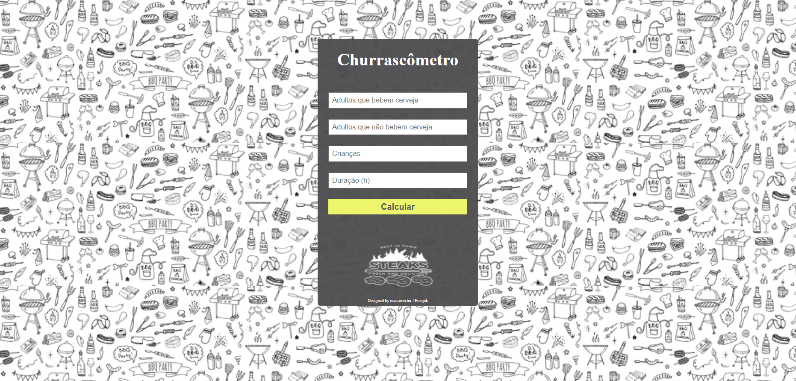

<h1 align="center" >Churrascômetro</h1>

Churrascômetro é um desafio proposto pelo curso do ProgramadorBR, em que o objetivo era calcular o gasto aproximado de um churrasco separando as crianças dos adultos, os adultos que bebem dos que não bebem, e avaliando a duração do churrasco.
 

O projeto foi desenvolvido com a finalidade de reforçar os conhecimentos básicos de <strong>HTML, CSS e Javascript</strong>.

É um site <strong>responsivo</strong> para diferentes tipos de dispositivos.

 

## Execução do projeto:
Para rodar o projeto é necessário clonar o repositório e abrir o arquivo index.html no navegador.

<h2 align="center"></h2>
<h2 align="center"></h2>

Feito por <a href="https://github.com/Edusorrentino10">Eduardo Sorrentino</a>.

Linkedin: https://linkedin.com/in/eduardo-sorrentino/